<html>
<head></head>
<body>
<h3>Page Authentification  au tant qu'utilisateur (user2)</h3>
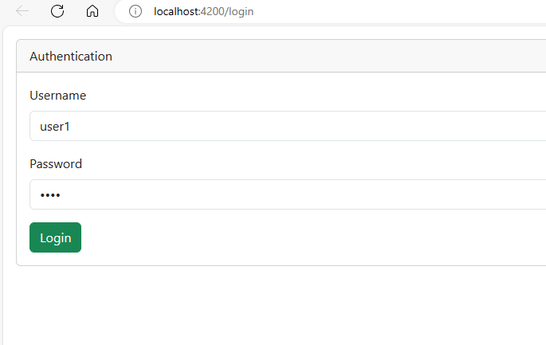
<h3>Page Home au tant qu'utilisateur (user2)</h3>
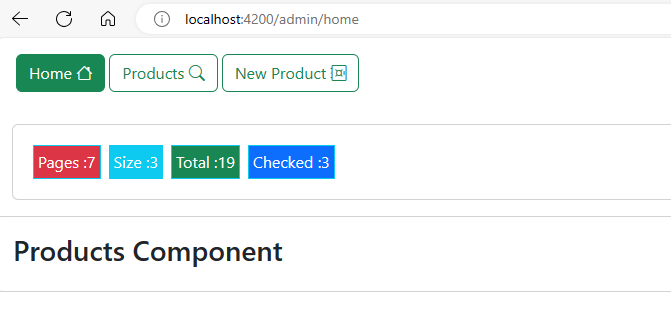
<h3>Page Liste des produits  au tant qu'utilisateur (user2)</h3>
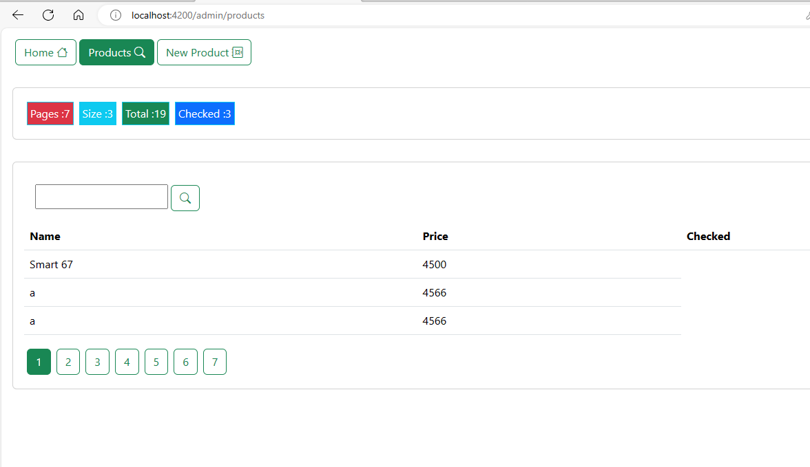
<h3>Recherche un produit (Smart67)  au tant qu'utilisateur (user2)</h3>
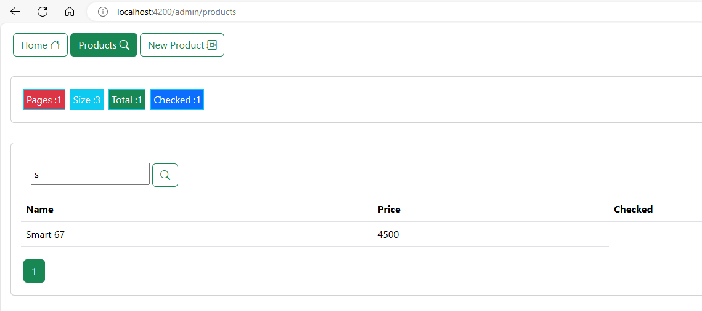
<h3>Page Authentification  au tant qu'administrateur (admin)</h3>
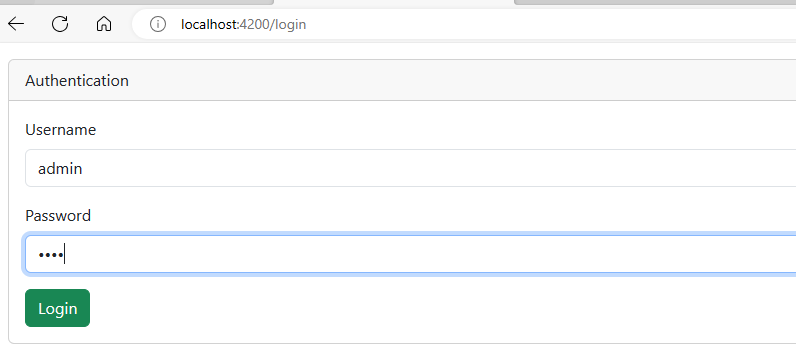
<h3>Ajout d'une produit au tant qu'administrateur (admin)</h3>
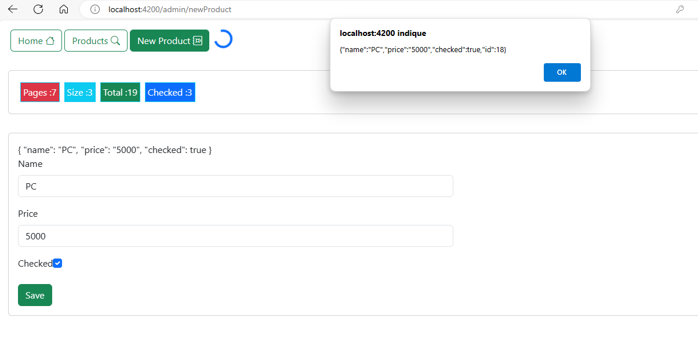
<h3>Ajout d'une produit(PC) dans la liste des produits  au tant qu'administrateur (admin)</h3>
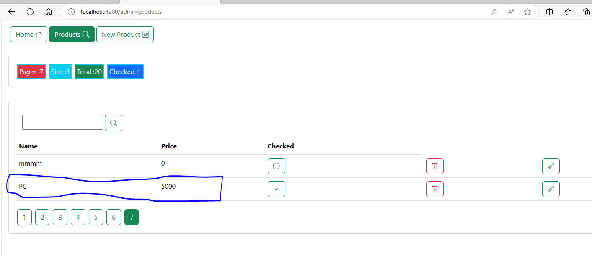
<h3>Suppression d'une produit dans la liste des produits  au tant qu'administrateur (admin)</h3>
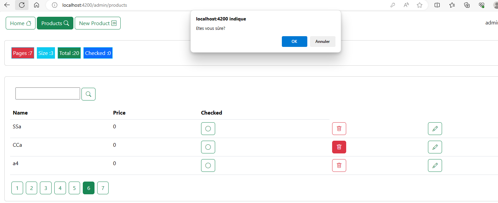
<h3>modification d'une produit au tant qu'administrateur (admin)</h3>
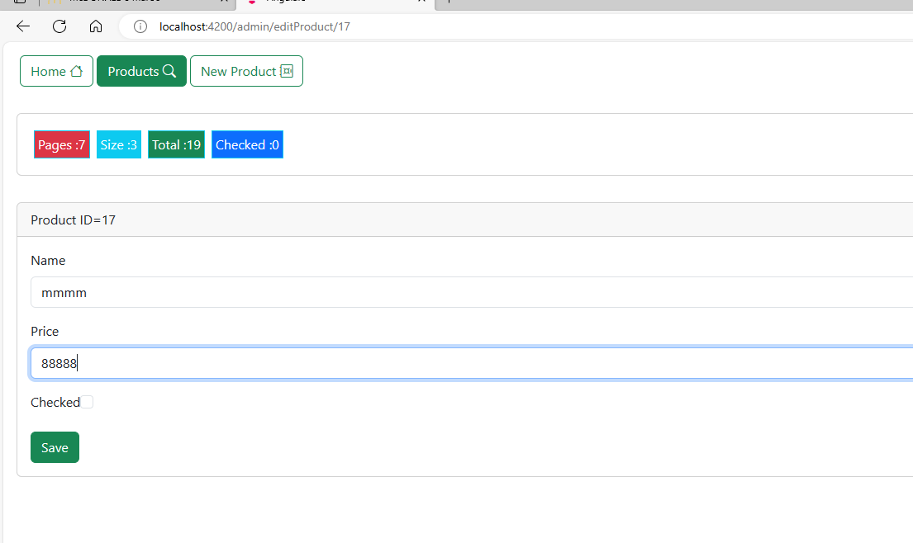
<h3>produit modifié au tant qu'administrateur (admin)</h3>
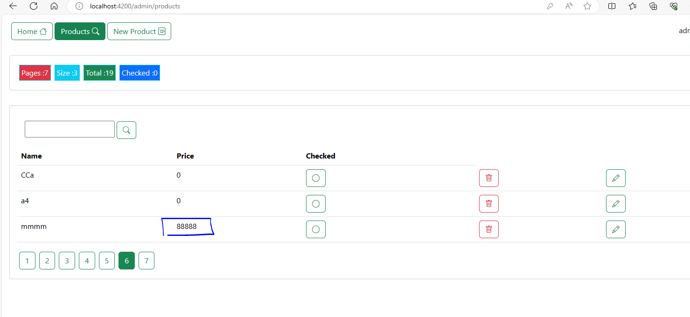
<h3>ng serve(executer)</h3>
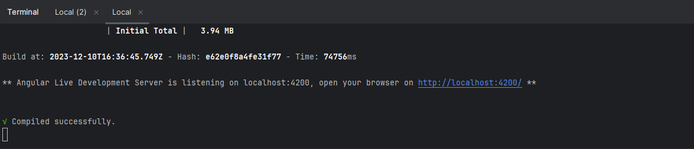
<h3>json-server -w data/db.json -p 8089 -H 0.0.0.0 (connecter au données de json server)</h3>
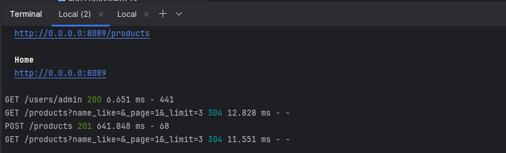
</body>
</html>
